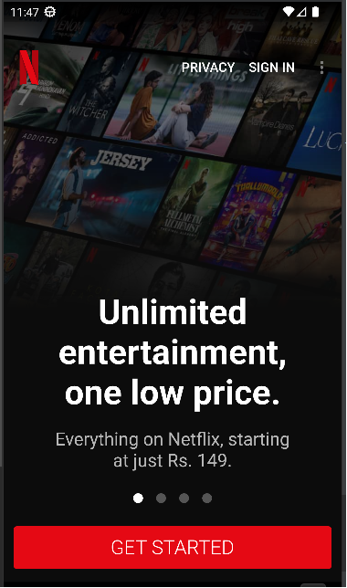
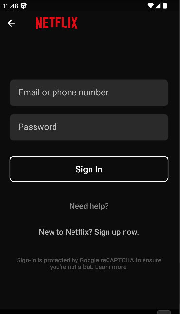

<h1 align="center">A Netflix UI clone in Flutter ! :sunglasses:</h1>

 

  

---
# Screenshots :

.
. 
.

 - Final APK is available in the [Screenshots Folder](Screenshots).
 
 #### This project still has scope of development, so you can also contribute to this Project as follows:
* Fork this Repository.
* Clone your Fork on a different branch:
	* `git clone -b <name-of-branch> https://github.com/tanmoy27112000/flutter_UI_design_hactoberfest.git`
* After adding any feature:
	* Goto your fork and create a pull request.
	* We will test your modifications and merge changes.

This project is done for `HacktoberFest 2022.`

---
<h3 align="center"><b>Developed with :heart: by <a href="https://github.com/randhirshaw">Randhir Shaw</a>.</b></h1>
